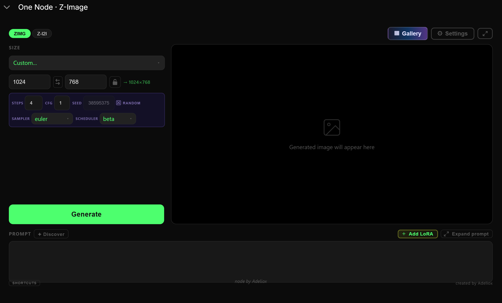

# One Node · Z-Image

[](https://github.com/comfyanonymous/ComfyUI)

> **One node, everything you need for Z-Image Turbo.**  
> No node graph, no spaghetti — prompt, generate, done.



---

## Installation

```bash
cd ComfyUI/custom_nodes/
git clone https://github.com/Adeliox/ComfyUI-OneNode-Z-Image.git
```

Restart ComfyUI. The node is in the menu under `right click → Add Node → ZImageOneNode`.

## Required models

Download and place in `ComfyUI/models/`:

| Model | Folder | Link |
|---|---|---|
| Z-Image Turbo UNET | `models/diffusion_models/` | [HuggingFace](https://huggingface.co/zerointensity/z-image-turbo) |
| Qwen 3.4B text encoder | `models/text_encoders/` | [HuggingFace](https://huggingface.co/zerointensity/z-image-turbo) |
| ae.safetensors (VAE) | `models/vae/` | [HuggingFace](https://huggingface.co/zerointensity/z-image-turbo) |

## Usage

- **ZIMG** — Text-to-Image. Enter a prompt, pick a resolution, generate.
- **Z-I2I** — Image-to-Image. Load an image, adjust denoise strength, generate.

---

**Original author**: [yanokusnir-ai](https://github.com/yanokusnir-ai) — creator of the FLUX.2 [klein] custom node from which this project was adapted.

**Z-Image adaptation & simplification**: Adeliox
